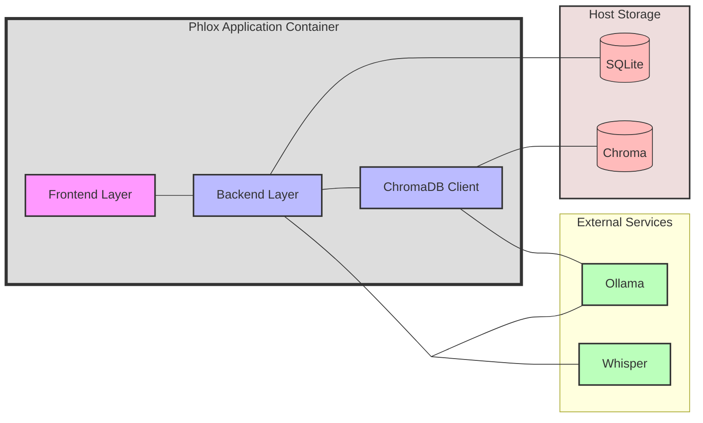

<p align="center">
  
</p>

[](https://github.com/bloodworks-io/phlox/actions/workflows/ci.yml)
[](https://snyk.io/test/github/{username}/{repo})
[](https://coveralls.io/github/bloodworks-io/phlox?branch=main)
[](https://opensource.org/licenses/MIT)
[](https://github.com/psf/black)
[](https://github.com/bloodworks-io/phlox/issues)


Welcome to Phlox, an open-source patient management/AI transcription/physician assistant solution that I've developed over the past few months with heavy input from various LLMs. There are a few really excellent and mature commercial solutions available for AI medical transcription, but none that I'm aware of attempt to roll in some decision support.

## Table of Contents 📑
- [What is it?](#what-is-it)
- [Architecture Overview](#architecture-overview)
- [Known Bugs](#known-bugs)
- [Roadmap](#roadmap)
- [Features](#features)
- [Stack](#stack)
- [Quick Start](#quick-start)
- [Usage Warning](#usage-warning)
- [HIPAA/GDPR Compliance](#hipaagdpr-compliance)
- [Philosophy](#philosophy)
- [License](#license)
- [Contributing](#contributing)

## What is it? 🩺
Essentially, it's a mix of:

- Basic patient record database
- "AI-powered" Medical Transcriptionist with customizable templates
- Task manager/todo list for clinics
- Simple RSS reader with LLM-generated summaries for quick review
- AI physician assistant (see disclaimer)

Most importantly, it all runs locally on commodity hardware! I use [Ollama](https://github.com/ollama/ollama) for inference and [Whisper](https://github.com/openai/whisper) for transcription. To keep things local and easy, I suggest spinning up a [Speeches](https://github.com/speaches-ai/speaches) instance for transcription. To record from the browser, you'll need a secure context (HTTPS). For local tinkering, most browsers allow exceptions for localhost.

## Architecture Overview 🏗️


## Known Bugs 🐛
- [ ] Processing documents don't work with the new template scheme
- [ ] Secondary model having context too small does not fail gracefully

## Roadmap 🗺️
- [ ] Reprocess if template changes after transcription
- [ ] Improve refinement process (allow custom refinement; use Ollama structured outputs)
- [ ] AI MDM; pass the case through a local reasoning model for more in-depth discussion.

## Features ✨

### Medical Transcription and Note Summarisation 🎤
Essentially, the browser sends an audio blob to a Whisper backend of your choice for processing. Usually, this will be an ambient recording of your review of the patient (be sure to tell them the encounter will be recorded!). The raw transcript is then fed through an Ollama backend in a quasi-CoT fashion with strucuted outputs to deliver a summarisation of the clinical encounter in the format of your choice. A numbered list of the items from the plan is also made.

Necessity is the mother of invention here; I was getting pretty dismal performance by just naively passing transcripts to the LLM (at least with the models I'm able to run in my homelab).I make heavy use of stop tokens and guided generation which seemed to be the missing sauce to get things working well.

Simply copy the final note into your EMR and save it into the local SQLite database. The patient's demographics, "Primary history" (what you see them for), and additional history can be autofilled from the database by searching the URN in subsequent encounters.

### Flexible Template System 📝
I've implemented a versioned template system that lets you structure your clinical notes however you prefer. Want numbered lists for your plan but bullet points for review of systems? No problem! Each template is versioneD, so you can experiment without breaking your existing templates.

The system can analyze an example note you provide and automatically generate a template that matches its structure. Just paste in a note you like, and it'll pick up on all the formatting patterns - whether you're using bullets, numbers, or narrative text.

Each template field can be configured with:
- Custom prompts to guide the AI's output
- Format specifications (bullets, numbers, narrative, etc.)
- Persistence flags to carry forward important info
- Required/optional status
- Refinement rules for post-processing

### Task Manager ✅
The plan from the clinic note is parsed into a JSON list which can then be manipulated from a few different pages. I've found this really useful for keeping on top of jobs from the clinic. As a nice little touch here, I utilize a smaller model (configurable in the setting page) to generate a 1-sentence summary of the encounter.

### Correspondence Generation ✉️
I've implemented a 1-click solution to generate correspondence based on the clinical note. It can be a bit verbose and definitely needs to be checked before sending off. You can refine the AI-generated letter with further instructions to get what you want, and you can even make letter templates too!

### Decision-Support/RAG 🤖
You can discuss each case with your primary model and upload relevant documents (guidelines, journal articles, etc) to the Chroma-powered RAG backend for it to peruse. Simply click the chat button on a patient encounter of interest. Any output here should absolutely be verified using primary sources as hallucinations abound (particularly with smaller models).

### Dashboard with Simple RSS Reader using LLM Summaries 📰
The landing page allows you to subscribe to RSS feeds of your choice. The primary model will then be used to generate quick summaries of each article for your reading pleasure. Useful for trying to keep on top of the latest PubMed trending articles in your field.

## Stack 🛠️
- **Frontend**: React/Chakra UI
- **Backend**: FastAPI
- **Database**: SQLite
- **Containerization**: Docker/Podman
- **LLM Backend/Inference Engine**: [Ollama](https://github.com/ollama/ollama)
- **Transcription**: Any Whisper compatible endpoint
- **RAG**: [Chroma](https://github.com/chroma-core/chroma)
- **Color Palette**: [Catpuccin](https://github.com/catppuccin/catppuccin)

## Quick Start 🚀

### Prerequisites
- Podman or Docker
- Ollama instance running locally or remotely
- Whisper-compatible transcription service

If you're familiar with Python, React, and working with LLMs, you'll find the project interesting. Feel free to clone the repo and examine the code:

```bash
git clone https://github.com/phlox-dev/Phlox.git  # Update with actual repo link
cd Phlox
```

For those of you who are comfortable with Docker/Podman and understand the risks, you can build the image:
```bash
podman build -t phlox:latest .
```

Once the image is built, you'll need to configure the environment variables. This is crucial for database encryption and basic application configuration.

### 1. Environment Variables
Create a `.env` file in the `phlox-dev/` directory. Here's an example `.env` file - customize it to your needs:

```env
# Required
DB_ENCRYPTION_KEY=your_very_secret_key_here
NODE_ENV=development  # or production
TZ=Australia/Melbourne  # Your timezone
```

**Important notes:**
- `DB_ENCRYPTION_KEY`: This key **must** be set for secure database access. Generate a long, random string. Keep this safe and secret! If you change it later, you will not be able to decrypt the database.
- The data from the application needs to be persisted. Review the mounting of /data in the `podman-compose.yml`.

### 2. Running Phlox

#### Production Deployment
Use the production compose file (`podman-compose.yml`):

```yaml
version: "3"
services:
  app:
    image: phlox:latest
    container_name: phlox
    ports:
      - "3000:3000"  # Only expose the frontend
    environment:
      - DB_ENCRYPTION_KEY=${DB_ENCRYPTION_KEY}
      - NODE_ENV=production
      - TZ=${TZ}
    volumes:
      - ./data:/usr/src/app/data # Only for persistent data
      - ./logs:/usr/src/app/logs # Optional: Persist logs
```

Run with:
```bash
podman-compose up
```
#### Development Setup
For development, use the development compose file (`podman-compose.dev.yml`):

```yaml
version: "3"
services:
  app:
    image: localhost/phlox-dev:latest
    #build: .
    container_name: phlox-dev
    network_mode: host
    environment:
      - DB_ENCRYPTION_KEY=${DB_ENCRYPTION_KEY}
      - NODE_ENV=development
      - TZ=${TZ}
    volumes:
      - ./public:/usr/src/app/public
      - ./server:/usr/src/app/server
      - ./src:/usr/src/app/src
      - ./logs:/usr/src/app/logs
      - ./data:/usr/src/app/data # Only for persistent data
```

Run the development environment:
```bash
podman-compose -f podman-compose.dev.yml up
```

### 3. Access Phlox
The application will now be available at http://localhost:3000. Configure your Ollama endpoint and other settings through the application's settings page.

### Why no pre-built image?

I'm a bit skeptical of making a turnkey solution (for example, an Electron app that will run natively on an M-series Mac). At least for the time being, I'm more comfortable if there is a bit of a technical barrier to prevent users who might be naive to the limitations of LLMs from running it too easily.


## Usage Warning ⚠️
This project is a real mess. The code is sloppy, the paradigms are half-arsed, and I've mixed concerns like I'm tossing a salad. There is probably more duplicated boilerplate than actual functioning code, thanks to my liberal use of LLMs as coding assistants.

This is very much a personal project and learning experience. If you're not sure how to run this or don't fully understand the limitations of current LLM technology in medicine, please don't use it in a clinical setting. The chat and RAG features, while cool, are unreliable and prone to hallucination. Especially if you use smaller models you will likely get awful treatment suggestions.

The smaller models do an okay job at summarizing transcripts, but output is better with larger models. ALWAYS verify the output. Even with large models, you will encounter inconsistencies.

Finally, expose this to the open internet at your own risk. There is no user authentication; you should definitely run this behind some kind of reverse proxy and auth solution. **Please assume that this system is less secure than a Windows 95 install exposed to the open internet!** You've been warned!

## HIPAA/GDPR Compliance 🔒
This project has **nothing to do with HIPAA or GDPR compliance**. It is intended for educational purposes only and should **not** be used in real-world clinical settings without proper security and compliance measures in place.

## Philosophy 💭
I'm cautious about using LLMs as an end-to-end diagnostic tool (although I might be a bit biased on that front - I do love my job!). However, I'm intrigued by their potential for supercharging clinical decision-making.

Both human and artificial reasoning seem to navigate similar landscapes of decision-making, each with their own basins of attraction that can either aid or impede accurate diagnosis. The vast training corpus of most modern LLMs is replete with case reports, studies, guidelines, and patient-produced accounts for essentially all known medical ailments; potentially offering a means to bootstrap clinician performance.

I'm as seasoned an AI skeptic as any other. While LLMs can help jolt clinical reasoning out of local minima, they can just as easily lead you into spurious attractors—entirely wrong regions of the diagnostic space that seem deceptively correct. This risk is particularly insidious with larger, more sophisticated models whose 'generative pastiche' can be extremely convincing yet fundamentally flawed.

**Ultimately, a medical practitioner bears responsibility for their decisions, and it's crucial to understand that no LLM (at least as currently architected) can reliably distinguish truth from plausible-sounding fiction. The goal here is to use LLMs as a tool for expanding our consideration set, while maintaining rigorous clinical judgment about which paths are worth pursuing.**

## Contributing 🤝
Contributions are always welcome! Please check out our [Contributing Guidelines](https://github.com/jfgonsalves/scribe/blob/main/.github/CONTRIBUTING.md) for how you can help.

## License 📄
This project is licensed under the MIT License. See the [LICENSE](https://github.com/jfgonsalves/scribe/blob/main/LICENSE) file for more details.
