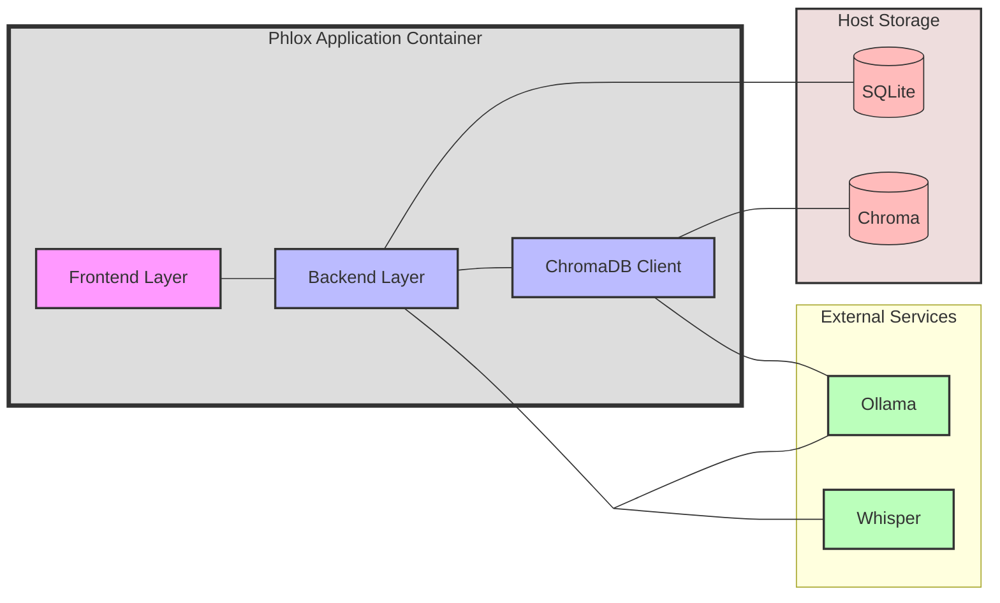

# Architecture Overview

## Components

- **Frontend**: React/Chakra UI
- **Backend**: FastAPI
- **Database**: SQLite (encrypted via `DB_ENCRYPTION_KEY`)
- **LLM**: Ollama
- **Transcription**: Whisper-compatible endpoint
- **RAG**: ChromaDB for document embeddings

## Data Persistence
SQLite and ChromaDB data persisted on host via volume mounts (`./data:/usr/src/app/data`)

## Deployment
Containerized using Docker/Podman

Make it a bit longer please

# Architecture Overview

## Components

### Frontend (React/Chakra UI)
- User interface and interactions
- API calls to backend
- Audio recording and playback

### Backend (FastAPI)
- REST API endpoints
- Core application logic
- Integrates with Ollama, Whisper, and ChromaDB
- Database operations

### Database (SQLite)
- Local file-based storage
- Encrypted via `DB_ENCRYPTION_KEY`
- Stores:
  - Patient records
  - Clinical notes
  - Templates
  - Settings

### LLM (Ollama)
- Local model inference
- Handles:
  - Note generation
  - Clinical summaries
  - RSS processing
  - RAG queries

### Transcription (Whisper)
- Compatible with any Whisper endpoint
- Converts audio to text
- Configurable service selection

### RAG (ChromaDB)
- Vector database for document storage
- Requires a tool calling model to be selected.
- Enables context-aware queries
- Stores medical document embeddings

## Data Persistence
- SQLite database and ChromaDB data persisted on host
- Volume mount: `./data:/usr/src/app/data`
- Data preserved across container restarts
