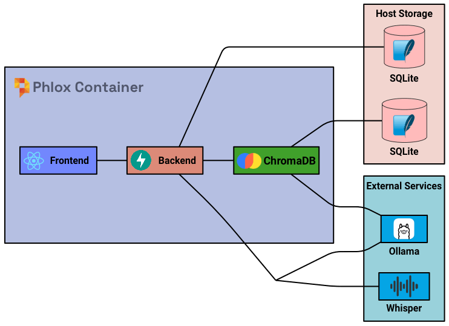

# Architecture Overview
<p align="center">

</p>

## Components

### Frontend (React/Chakra UI)
- User interface and interactions
- API calls to backend
- Audio recording and playback

### Backend (FastAPI)
- REST API endpoints
- Core application logic
- Integrates with Ollama, Whisper, and ChromaDB
- Database operations

### Database (SQLite)
- Local file-based storage
- Encrypted via `DB_ENCRYPTION_KEY`
- Stores:
  - Patient records
  - Clinical notes
  - Templates
  - Settings

### LLM (Ollama)
- Local model inference
- Handles:
  - Note generation
  - Clinical summaries
  - RSS processing
  - RAG queries

### Transcription (Whisper)
- Compatible with any Whisper endpoint
- Converts audio to text
- Configurable service selection

#### Transcription Flow
The transcription process involves multiple steps to convert audio into structured clinical notes within the constraints of smaller, locally-hosted models.

1. **Audio Recording/Upload**
   - Browser records audio or accepts file upload
   - Audio sent to backend as WAV format

2. **Initial Transcription (Whisper)**
   - Audio processed by configured Whisper endpoint
   - Returns raw text with timestamps
   - Segments combined into single transcript

3. **Template Processing (Ollama)**
   - Transcript broken into template fields to manage context length
   - Each field processed concurrently to:
     1. Extract key points as structured JSON
     2. Perform content refinement
     3. Apply formatting

   This staged approach helps smaller models by:
   - Breaking large transcripts into manageable chunks
   - Using structured JSON to constrain outputs
   - Allowing multiple refinement passes with focused prompts
   - Reducing hallucination risk through structured extraction

4. **Final Assembly**
   - Processed fields combined into complete note
   - Patient context merged
   - Formatting rules applied
   - Results returned to frontend

### Model Considerations

- **Output Quality:** Smaller models can hallucinate or lose coherence with long outputs. Chunking and JSON extraction step helps maintain structure and accuracy.

- **Compute Resources:** Async processing of fields with Ollama improves performance if concurrency is enabled.

- **Refinement Passes:** Multiple focused passes often produce better results than trying to get perfect output in one go with smaller models.

Example flow for a single field:
```txt
Audio → Whisper Transcription → JSON Extraction → Refinement → Formatting → Final Output
```

### RAG (ChromaDB)
- Vector database for document storage
- Requires a tool calling model to be selected.
- Enables context-aware queries
- Stores medical document embeddings

## Data Persistence
- SQLite database and ChromaDB data persisted on host
- Volume mount: `./data:/usr/src/app/data`
- Data preserved across container restarts
