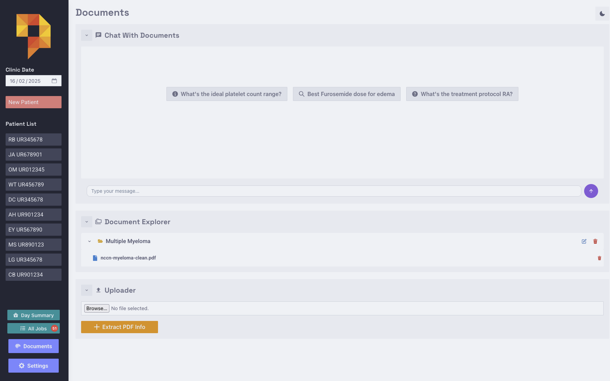
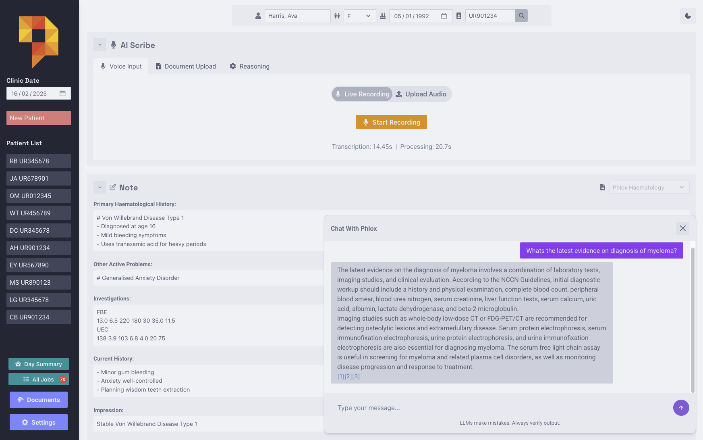
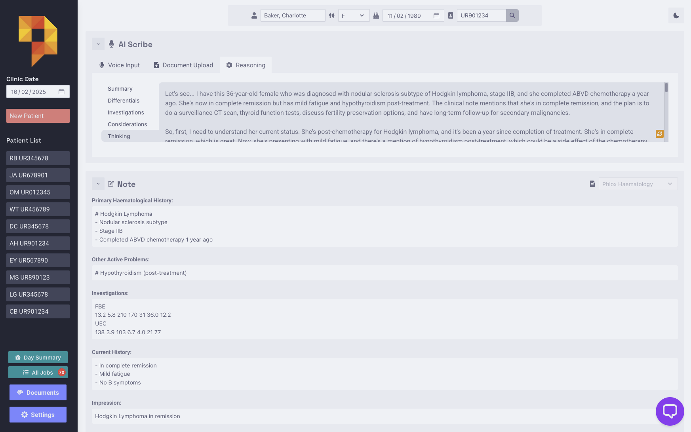

# AI Features

Phlox includes a few ways to chat with documents and clinical notes using LLMs:

## Document Chat
Chat with uploaded medical documents and guidelines:

1. Upload PDFs to collections in the Document Explorer
2. Ask questions about the documents
3. Get responses with citations to specific document sources

## Case Chat
Discuss patient cases with the LLM:

1. Click chat icon in patient view
2. Ask questions about the current case
3. LLM references the clinical note content in responses
4. The LLM will also make a tool call to the RAG database if required

## Clinical Reasoning Assistant
Generate structured clinical analysis for patient encounters:

1. After creating a clinical note, click "Generate Reasoning"
2. The LLM will analyze the case and provide:
   - Brief case summary
   - Differential diagnoses
   - Recommended investigations
   - Key clinical considerations
3. Review the AI's thinking process and suggestions
4. Use as prompts for further investigation or discussion

Note: Like all LLM outputs, reasoning suggestions should be verified against clinical judgment and guidelines. At the moment, reasoning does not make tool calls to the RAG database.

