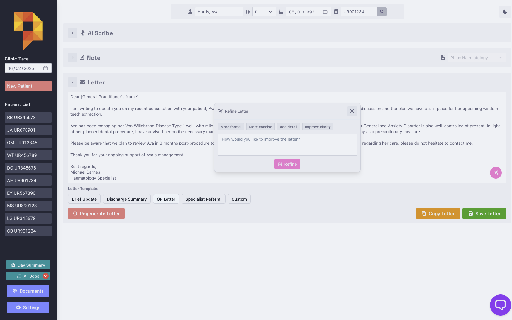

# Correspondence Generation

Generate patient letters from clinical notes using templates and LLM refinement.

## Usage

1. Click "Generate Correspondence" after creating note
2. Select template or use custom instructions
3. Edit or refine letter using LLM suggestions
4. Copy or save final letter

## Features

- Templates for standardized letter formats
- Interactive refinement with LLM
- Automatic token management for context length
- Save letters for reference

## Templates

Create and manage letter templates in Settings:

- Default templates included
- Custom templates with specific instructions
- Set default template for quick generation

