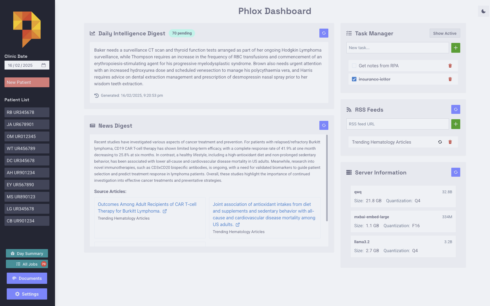

# Dashboard with RSS Reader

The dashboard includes a simple RSS reader that automatically generates summaries of medical articles using an LLM.

## Usage

1. Add RSS feeds in the dashboard
2. Summaries are generated overnight (requires instance to be running)
3. View summaries and article links in the dashboard

Note: The UI may be unresponsive during summary generation since LLM calls here are currently blocking.

## Tip

Make sure you subscribe only to reputable medical/clinical RSS feeds since summary quality depends on the source material.

