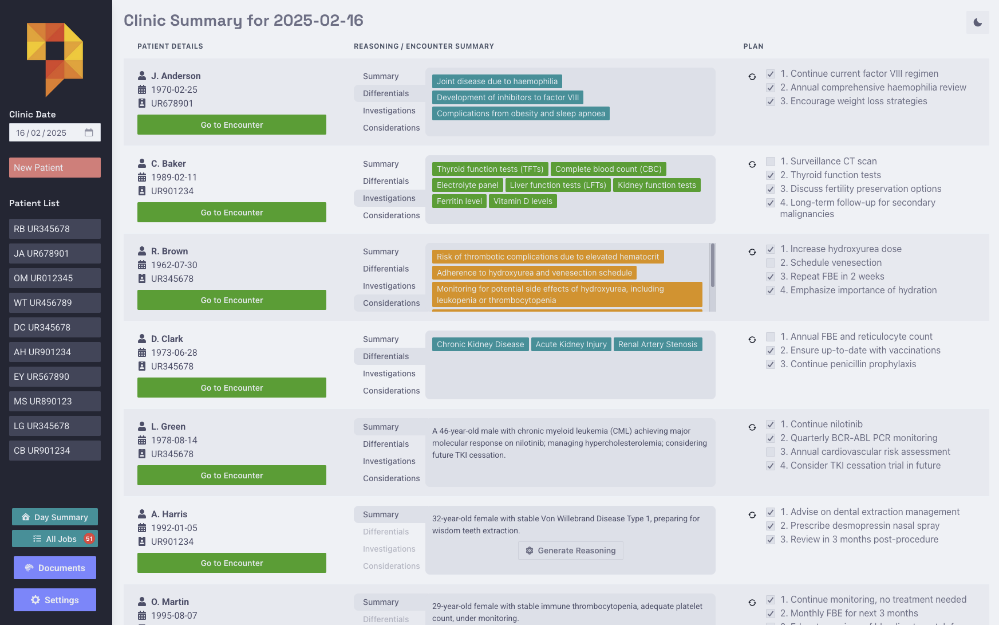

# Task Manager

The task manager automatically extracts action items from clinical notes and tracks their completion status.

Phlox also has a basic ToDo feature for other tasks. This appear in the dashboard.

## Usage

1. Tasks are automatically created from numbered items in the Plan section of notes:
```
Plan:
1. Order blood tests
2. Follow up in 2 weeks
```

2. View tasks:
- Per clinic day: Go to "Clinic Summary"
- All outstanding tasks: Go to "Outstanding Tasks"

3. Mark tasks complete by clicking checkboxes

No setup needed - tasks are auto-generated when saving notes. The sidebar shows a count of incomplete tasks.

<p align="center">

</p>
